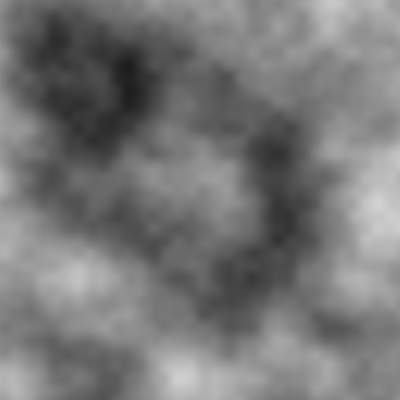

# Nature of Code Studies

I created this project as a way to document my studies following Daniel Shiffman's [Nature of Code](https://natureofcode.com/). I aim to use it not only as a VCS for my code, but also as a notebook of sorts, where I can document my progress and my challenges.

# Log

## Day 1 (11-03-21) - Perlin Noise
### Disclaimer: I'm writing this on saturday as I forgot to log the previous day.

Even though I'm no stranger to programming and am already very comfortable with most of programmings basic and intermediate concepts, even some advanced ones, I decided to start my journey through the book at the beggining, as in my experience there is always something to learn when you go back to basics.

### My Approach
I decided to couple the book with Daniel Shiffman's videos at [The Coding Train](https://www.youtube.com/channel/UCvjgXvBlbQiydffZU7m1_aw/featured) as I usually learn best from videos, but still want to see the contents of the books. 

I also decided to work with p5.js as is apparent in this projects repository, but the [video series starts](https://www.youtube.com/playlist?list=PLRqwX-V7Uu6ZV4yEcW3uDwOgGXKUUsPOM) in a strange way, as the Introduction chapter of the book is covered in older videos in a different order, thus I decided to follow the videos up to the end of the Introduction videos and before starting the next chapter I'll read the book's Introduction chapter, to see if there's anything more to what I already did while following the videos.

### Project Setup
I am still deciding on how to organize the files in this project, not sure if keeping all the logs in the README will be the best approach, but I'll look into that later if I see that it's bloating the landing page of the project.

I had a problem with the p5.js libraries where if I stored them in a folder on the root of the project the javascript couldn't reach (for whatever reason) so I temporarily stored them inside each projects folders and will look into that later as I just wanted to get this project started.

### Perlin Noise
I've known and used Perlin Noise in a lot of different projects, but it's nice to see it in different dimensions and use cases, overall it's been a fun exercise messing with the noise's variables and mapping it in a graph and a 2D grid.

### Future Possibilities
Some things I want to do in the future regarding Perlin Noise:

* Implement Perlin Noise from scratch
* Work with simplex noise and maybe implement that as well
